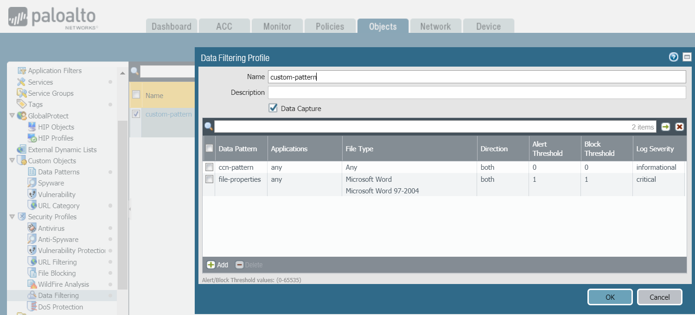
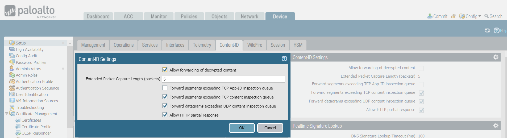
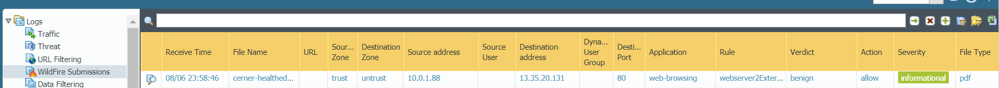

# palo-alto-networks-configuration

For the uploaded configuration I've `REDACTED`the `phash`, `public-key` and `sysLogIp`. I've added a utility.sh file makes replacing them easier

# 1. Base configuration according to tutorial

## 1.1 Tutorial details

This is the link I followed, titled [Launch the VM-Series Firewall on AWS](https://docs.paloaltonetworks.com/vm-series/9-1/vm-series-deployment/set-up-the-vm-series-firewall-on-aws/deploy-the-vm-series-firewall-on-aws/launch-the-vm-series-firewall-on-aws.html#ide07b93a2-ccb3-4c69-95fe-96e3328b8514)

Some details about my configuration

| Name                                                     | Value                                          |
| -------------------------------------------------------- | ---------------------------------------------- |
| VPC Cidr                                                 | 10.0.0.0/16                                    |
| Public Subnet                                            | 10.0.0.0/24                                    |
| Private Subnet                                           | 10.0.1.0/24                                    |
| Public route table                                       | Internal route and internet route to IGW       |
| Private route table                                      | Internal route and internet route through eth2 |
| eth0                                                     | Default (10.0.0.115)                           |
| eth0 is assigned an EIP                                  | Redacted                                       |
| eth1 untrust                                             | 10.0.0.1                                       |
| eth1 is assigned an EIP and this is how we connect to it | Redacted                                       |
| eth2 trust                                               | 10.0.1.1                                       |
| Private web server                                       | 10.0.1.88                                      |

## 1.2 Fixing the base configuration

Explanation: Since the application instance sits in a private subnet and talks to eth1 through eth2, we need to specify a source translation from eth1 to eth2. Subsequently, the destination translation to hit the web server will work

# 2. Configuring syslog monitoring

This link shows a step by step guide: [Configure Syslog Monitoring](https://docs.paloaltonetworks.com/pan-os/8-1/pan-os-admin/monitoring/use-syslog-for-monitoring/configure-syslog-monitoring)

# 3. URL filtering

Palo Alto provides a list of URLs that belong to each of the categories that are predefined. The link to these can be found at [Complete List of Pan-DB URL Filtering Categories](https://knowledgebase.paloaltonetworks.com/KCSArticleDetail?id=kA10g000000Cm5hCAC)

# 4. File blocking

When I tested, I could not block HTTPs downloads of .exe files. Hence for testing I used HTTP for now. This [link](https://live.paloaltonetworks.com/t5/threat-vulnerability-discussions/file-blocking-exe-vs-exe/td-p/184568) explains why

Sample URL to test executable downloads: http://s3.amazonaws.com/session-manager-downloads/plugin/latest/windows/SessionManagerPluginSetup.exe

# 5. Data filtering

This [link](https://knowledgebase.paloaltonetworks.com/KCSArticleDetail?id=kA10g000000PPJBCA4&refURL=http%3A%2F%2Fknowledgebase.paloaltonetworks.com%2FKCSArticleDetail) shows how to filter based on regex expressions, file contents and file properties.

Here I configure file filtering based on credit card numbers and for word documents where the owner is "glenn"

Steps

1. Define the data patterns: Objects -> Custom Objects -> Data Patterns
2. Use the data patterns in Data Filtering make sure to enable `Data Capture`. For the word document I configure both the `Alert Threshold` and `Block Threshold` to alert and block the moment we see a word document with the title "glenn". Here I also change the `Log Severity` level to `critical` for testing
   
3. Add the Data Filtering profile to the policy's `Profile Setting`

# 5. WildFire Analysis

Steps

1. Allow forwarding of decrypted content
   
2. Then enable WildFire logs to log benign files and graywire files. Take note of the file size limits. This can be adjusted.
   
3. The default WildFire security profile takes in any file type (Of course within the supported file types such as pdf and pe)
4. Attach this security profile to the security policy

These are some safe sample links to test wildfire with (Note that if there is a file blocking policy in place, then it won't be sent to WildFire)

- Link to test .exe files: http://wildfire.paloaltonetworks.com/publicapi/test/pe
- Link to test .pdf files: https://d1.awsstatic.com/architecture-diagrams/ArchitectureDiagrams/cerner-healthedatalab-overview-ra.pdf?did=wp_card&trk=wp_card

Example result

