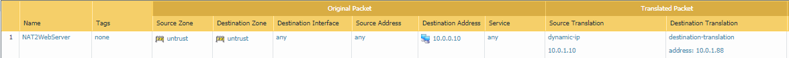

# palo-alto-networks-configuration

For the uploaded configuration I've `REDACTED`the `phash`, `public-key`. I've added a utility.sh file that makes replacing them easier

# 1. Base configuration according to tutorial

## 1.1 Tutorial details

This is the link I followed, titled [Launch the VM-Series Firewall on AWS](https://docs.paloaltonetworks.com/vm-series/9-1/vm-series-deployment/set-up-the-vm-series-firewall-on-aws/deploy-the-vm-series-firewall-on-aws/launch-the-vm-series-firewall-on-aws.html#ide07b93a2-ccb3-4c69-95fe-96e3328b8514)

Some details about my configuration

| Name                                                     | Value                                          |
| -------------------------------------------------------- | ---------------------------------------------- |
| VPC Cidr                                                 | 10.0.0.0/16                                    |
| Public Subnet                                            | 10.0.0.0/24                                    |
| Private Subnet                                           | 10.0.1.0/24                                    |
| Public route table                                       | Internal route and internet route to IGW       |
| Private route table                                      | Internal route and internet route through eth2 |
| eth0                                                     | Default (10.0.0.115)                           |
| eth0 is assigned an EIP                                  | Redacted                                       |
| eth1 untrust                                             | 10.0.0.1                                       |
| eth1 is assigned an EIP and this is how we connect to it | Redacted                                       |
| eth2 trust                                               | 10.0.1.1                                       |
| Private web server                                       | 10.0.1.88                                      |

## 1.2 Fixing the base configuration

Explanation: Since the application instance sits in a private subnet and talks to eth1 through eth2, we need to specify a source translation from eth1 to eth2. Subsequently, the destination translation to hit the web server will work

# 2. Configuring syslog monitoring

This link shows a step by step guide: [Configure Syslog Monitoring](https://docs.paloaltonetworks.com/pan-os/8-1/pan-os-admin/monitoring/use-syslog-for-monitoring/configure-syslog-monitoring)